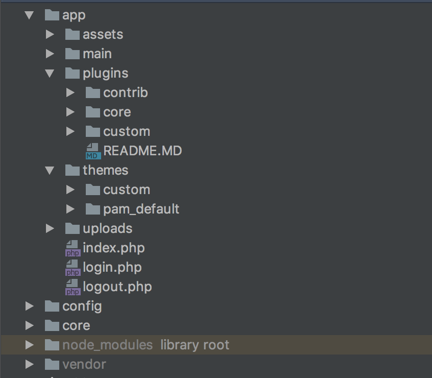
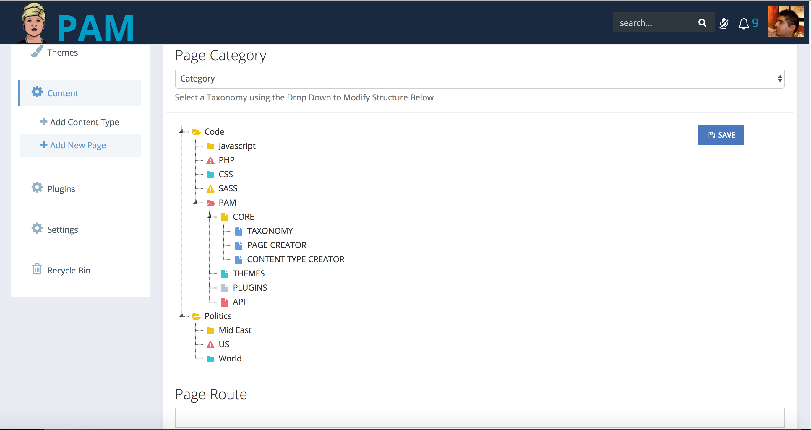
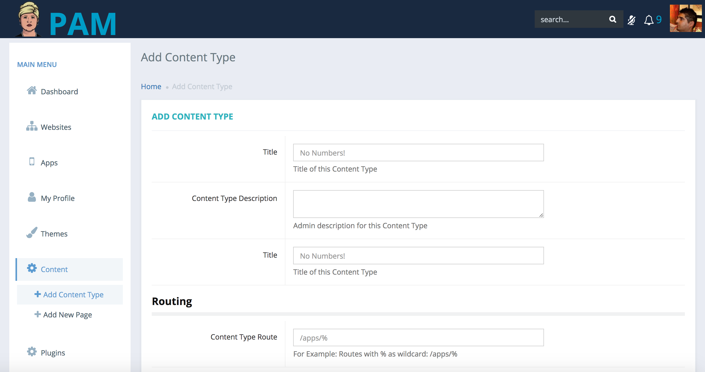
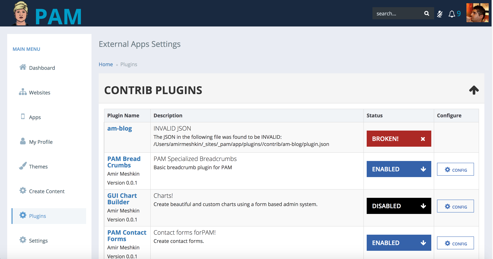

## Synopsis

PAM is a new node based MVC framework made from best parts of PHP, ANGULAR and MONGODB.  PAM is also designed to work without any database at all, and can easily also use mySQL or any other database you like.

We chose mongodb as a default because of its speed and flexibility.

PAM is a work in progress and still in development. 

<b>We are currently looking for contributors.</b>

<b>Please email me at amir.meshkin @ gmail.com to become a contributor</b>

## How it Works

PAM uses node.js, composer and bower.  

The plugins and themes for PAM use a shared bower based library.  Dependenceis and files are automatically loaded, minified and concatenated.

Docker is also slated to be added to make installation easier.

## PHP Heavy Lifting

PHP serves as the rest server for PAM.  PHP does the heavy lifting, logic, and mongodb connection.

 ## CORE
 
 Certain modules are kept in core such as Content Creator, Taxonomy and Auto Update.  Here is a preliminary folder structure for PAM.

 ## CORE: FORMS
 
 Forms in PAM are created in mongodb JSON.  Forms can easily be copied from one content type to another because they are component based.

 Each Plugin also has forms saved in MONGODB, both structure and data from the form itself.
 
 Components such as autocomplete boxes, or the taxonomy/category creator below are created easily with one block of JSON code.
 
 
 
  ## CORE: CREATOR
  
  PAM allows a GUI based system for creating new content types, equivalent to a wordpress custom post type.  There is no need to write any PHP functions.  A simple block of JSON creates a form used to create new content types.  You can also create pages with angular routing without having to touch a routing.js file.  The gui does all the angular routing code for you using PHP, all from a GUI based Add Screen.
 
  
 
   ## CORE: API

  PAM uses a fast JSON based REST API powered by PHP.  PAM is flexible so you don't even have to use PHP to provide your data.  Each page and content type in PAM has the ability to also get JSON data from external API's.
 
  ## PLUGINS
  Plugins in PAM are handled using bower, much like themes.  A plugin.json file tells PAM which bower components and loose js/css files to use.
  
  PAM's plugin page will even tell you when a plugin.json file is broken or missing!
  
  We plan to add a plugin directory making it very easy to install, update, and create new plugins for PAM!  
  
  
  
 
 ## THEMES
 
 Themes in PAM use BOWER to install front end components.  All the CSS and JS from a theme is automatically concatenated.  No more loose JS files and dozens of requests. PAM automatically takes care of all front end CSS and JS for you.

## VOICE CONTROL

Voice Control with annyang!

## BITCOIN PAYMENTS

Use the STRIPE API to pay with bitcoin and soon ethereum as well!

## Motivation

I've built websites for a living for almost 20 years.
 
I've worked with virtually every CMS there is.  PAM is simple but powerful result of 20 years of experience building and managing websites.

## PRE CODE RELEASE

We're working hard to present a working stable and powerful version of PAM CMS, but for now we are keeping the code to ourselves!  If you would like to contribute to this brand new exciting project, please do contact us.

